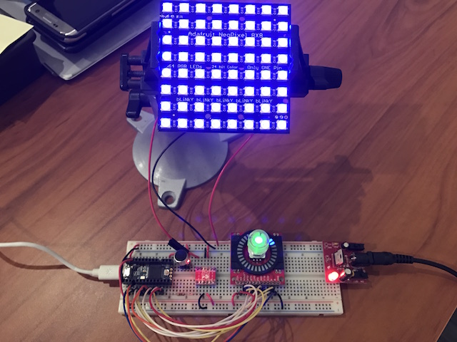

# FireStalk
### Audio Responsive + Multi-Animation LED strip controller

Build Logs:
+ [Log 0 - High Level to Breadboard](https://medium.com/@KyleRStewart/build-log-0-burn-stick-high-level-to-breadboard-33bd3ba6bb41#.ruklbfxrv)

Important Libraries:
+ Audio library for Teensy [https://github.com/PaulStoffregen/Audio](https://github.com/PaulStoffregen/Audio)
+ FastLED [http://fastled.io/](http://fastled.io/)

Notes:
+ Use 96MHZ clock speed on programming - Audio library needs this
+ Aim for a 1m distance between power connections - you can wire power supply anywhere in the strand
+ Need a logic level shifter for 3.3 to 5V levels if you want high output LEDs
+ To bridge pixels to controller, match grounds but not VCC levels
